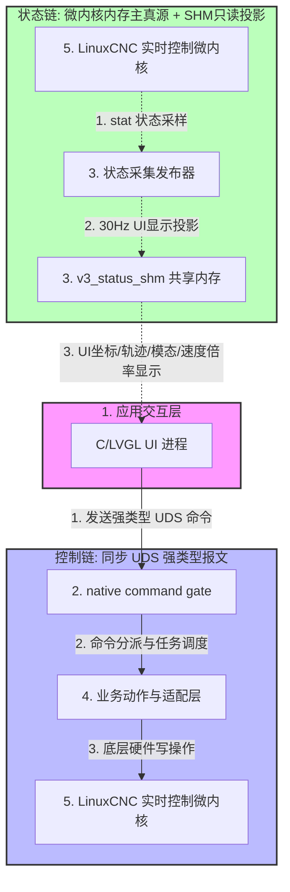

# V3 系统代码架构硬边界守则

<!-- AI_FAST_READ_BEGIN -->
owner_reqs: [REQ-NATIVE-OWNER-FIRST, REQ-LINUXCNC-COMMAND-GATE, REQ-SERVICE-RUNTIME-SANDBOX]
read_when: [控制链与状态链, Command Gate/NML监听, SHM边界, native owner下沉, 服务权限, 新IPC或fallback, CPU0/CPU1隔离]
truth: [C UI -> framed UDS native Command Gate -> 仅本机LinuxCNC/HAL/EtherCAT/native；运行actual归native resident owner，SHM只作显示投影；CPU0只承载运动实时闭集，Start后运动不依赖CPU1]
forbidden: [UI/通用工具直连控制端口, 外部NML/linuxcncrsh listener, Python控制中转, 文件/JSON控制IPC, SHM/cache作actual, steady-state fork, 第二owner或测试fallback, 全局可写设备, 生产调试代理, 非运动任务进入CPU0]
readback: [native generation/actual, Command Gate响应, listener与唯一客户端, 设备mode/group与生产服务权限, owner状态API, LinuxCNC/HAL/EtherCAT actual, affinity/scheduler/IRQ与servo/DC/WKC]
impact: [功能owner, UI命令, Command Gate/NML/INI, runtime policy/rootfs设备规则, native status API, State Publisher/SHM, HAL/INI, service manifest, CPU隔离]
acceptance: [先回答`0.2`并按`0.3`选择唯一路径；删除旧路后跑focused门禁；需要board_verified时再构建部署并走operator path，同时证明监听/权限边界和CPU1压力下运动连续]
detail_sections: [0.1 一句话总原则, 0.1A 最高准则：可下沉微内核的一律下沉微内核内存, 0.2 AI 修改前必须回答的 7 个问题, 0.3 红线与正确路径, 0.5 当前 owner 落点表, 0.6 触碰式 owner 下沉规则, 3. 控制链（Control Chain）硬边界红线, 4. 状态链（State Chain）硬边界红线, 5. 安全提权与系统加固硬边界红线]
<!-- AI_FAST_READ_END -->

## 0. AI 快速入口

本文件不是建议文档，而是 V3 系统代码的架构硬边界。`功能/需求真源索引.md` 和其指向的 `功能/` owner 文档是最高产品需求；本文只作为架构边界 owner，不能覆盖 `功能/` owner 已经确定的功能行为、字段清单、按钮语义、运行真源或验收边界。AI 接手任何代码修改时，必须先按本节完成判断，再继续阅读后续细则。

跨功能或容易变化的需求以 `功能/需求真源索引.md` 的 `REQ-*` owner 表为入口；本文只作为架构边界 owner，不复制其他 owner 的可变政策全文。非 owner 文档里的旧硬规则若与索引指向的 owner 冲突，视为待同步债务。

引用需求真源：`REQ-DOC-SINGLE-SOURCE`、`REQ-UI-RUNTIME-REFRESH-RATE`、`REQ-PARAM-MEMORY-LIGHTWEIGHT-SAVE`、`REQ-NATIVE-OWNER-FIRST`、`REQ-SERVICE-RUNTIME-SANDBOX`、`REQ-SETTINGS-RUNTIME-DRIVE-ONLY`、`REQ-BUS-PULSE-MODE-DIFFERENCE`、`REQ-SCALE-CHAIN-HISTORY-POLLUTION`、`REQ-DRIVE-PROFILE-AUTH-CHAIN`、`REQ-TOUCH-CALIBRATION-INPUT`、`REQ-LINUXCNC-COMMAND-GATE`、`REQ-G92-NATIVE-RUNTIME`、`REQ-WCS-NATIVE-OWNER`、`REQ-ROTARY-UNWRAP-ABSOLUTE-PROOF`、`REQ-ROTARY-REBASE-NATIVE-GATE`、`REQ-RTCP-G53-NATIVE-ACTUAL`、`REQ-START-RUN-HOT-PATH`、`REQ-MAIN-ESTOP-LATENCY`、`REQ-MOTION-STILLNESS-TOLERANCE`、`REQ-GCODE-RUN-HOT-PATH`、`REQ-CPU0-MOTION-REALTIME-DOMAIN`、`REQ-MICROKERNEL-MOTION-LOOKAHEAD`、`REQ-RTCP-NATIVE-STATUS-SOURCE`、`REQ-NO-PERIODIC-DISK-WRITES`。

### 0.1 一句话总原则

V3 只允许一条控制链和一条状态链：

```text
控制链: UI C -> native command gate UDS framed socket -> LinuxCNC/微内核/HAL/EtherCAT/native owner
状态链: 微内核/native 常驻内存/API 为主真源；SHM 只允许 30Hz 同步 UI 显示投影：编码器反馈机械坐标、运动学理论坐标、转速、进给速度和主轴/进给倍率，不得作为其它状态访问路径、准入真源或 Broker/product action 回读依据
```

任何让 UI、Broker、product action、测试或临时工具绕开这两条链路的改动，默认都是架构违规，除非本文件明确允许且只存在于临时诊断目录。

CPU/IRQ 隔离是与控制链、状态链并列的第三条硬边界：CPU0 只允许持续运动截止期内不可缺少的运动实时闭环；Start 前能完成的兼容翻译、文件读取、解析、索引和预装留在 CPU1，但 Start 后的运动不得依赖 CPU1 继续推进。UI、Publisher、镜像、日志、网络、文件系统和其它非运动工作全部属于 CPU1。UI 即使完全卡死、CPU1 即使 100% 满载，CPU0 的调度、运动总线 IRQ、轨迹队列和运动链也不得被抢占、迁移、耗尽或阻塞，运动必须连续。完整任务闭集、过载退化和板端验收由 `REQ-CPU0-MOTION-REALTIME-DOMAIN` 唯一裁决。

native owner 优先、LinuxCNC command gate、参数表开机入内存、drive-only 收敛、RTCP native 状态源、G-code 运行热路径、Start 热路径、静止容差、BUS/Pulse 模式和触摸校准输入链路，均以 `功能/需求真源索引.md` 中对应 `REQ-*` 为入口，并以索引指向的 owner 文档正文为准。

最高产品需求口径：凡是本文、`AGENTS.md`、待办、测试、旧注释或旧聊天与 `功能/需求真源索引.md` 指向的 owner 文档冲突，一律以 `功能/` owner 为准。本文只能补充架构实现边界，不能在功能 owner 之外新增第二套产品需求、第二套字段白名单、第二套控制链或第二套状态真源。

本文只保留架构红线：V3 不得为 LinuxCNC/微内核/HAL/EtherCAT/native 已有 owner 的语义再造最终真源；登记 native/helper daemon 或小状态块只能作为上层直连微内核/native 内存的最小 adapter，不能成为 UI/Broker/product action 的控制入口、参数 owner 或第二真源；`settings_runtime.json` 只能保留 Settings Drive 私域和已清洗的最小驱动/count-domain 证据；`settings_projection`、WCS、RTCP actual/几何、tool、状态、安全、诊断和动作结果不得再发布到 SHM，必须直连微内核/native。SHM 例外只允许 UI 显示投影：编码器反馈机械坐标、运动学理论坐标、`spindle_speed_rpm`、`linear_velocity_mm_per_min`、`feedrate_override`、`spindle_override`；这些字段不得成为动作证明、门禁或第二真源。运行态 actual 和启动默认配置必须分域，不得互相回写。

最新口径：除微内核/LinuxCNC/HAL/EtherCAT/native 硬安全、急停、限位、实时联锁，以及 VPS/授权/下载身份链外，UI、Broker 和 product action 不得保留自写准入门禁、速度证明门禁、身份字段白名单门禁、status epoch 门禁、backend-ready 门禁或 BUS/Pulse 软模式阻断来决定普通产品动作能否下发。上层只负责请求构造、Broker 路由、结果透传、诊断记录和显示；真实安全与物理保护由底层 owner 负责。

这里禁止的是 UI/Broker/product action 在运行期重复实现 `backend-ready` 产品动作门禁，不禁止开机 supervisor 在正式首帧与输入交接前消费唯一 native readiness owner 的生命周期 token。启动 consumer 只能核对 owner alive、PID/start_ticks、generation 和必要 freshness，不能重跑 CPU/IRQ/scheduler、OP/WKC/DC 或 `/proc` 全局扫描；运动动作最终能否执行仍由微内核/native motion gate 判断。开机可见性 barrier、底层运动准入和上层产品动作不得合并成同一套重复门禁。

弃用代码处理口径：发现旧链路、旧分支、旧 helper、旧 JSON/SHM 字段、兼容入口、fallback、shadow path、临时绕路或疑似 AI 自造分支时，先核对 `功能/需求真源索引.md` 指向的 owner、当前调用方和部署依赖。确认属于退役路径后，先把仍受支持的真实依赖迁入 canonical owner，再在同一 slice 物理删除旧路；随后按本地 focused gate、受影响 target/package、必要 downstream current artifact 暴露并修复真实缺口。不得借删除规则破坏无关用户改动或尚受支持的行为，也不得为了消除报错恢复旧分支、包兼容、改名保留或加开关隐藏。

### 0.1A 最高准则：可下沉微内核的一律下沉微内核内存
凡是能够由微内核、LinuxCNC realtime、HAL realtime component、EtherCAT、驱动或 FPGA/native owner 承担的运行态状态、参数、准入判断、运动保护、窗口/坐标基、stillness、急停/复位、RTCP/G53 actual、rotary checkpoint/rebase、Start/Jog/Home/Work Zero 运行期事实，最高 owner 必须下沉到微内核/native 常驻内存，以上层可直接读取的微内核内存/API/登记 native memory block 为主真源。

对上述可下沉范围，禁止把 `/dev/shm/v3_status_shm`、V3 typed SHM、State Publisher 投影、JSON、`/run` result、缓存文件、UI 内存、Broker 字段或 product action 局部状态当成准入访问路径、参数 owner、运行态真源或回读证明。SHM 只允许 30Hz 同步 UI 显示投影：编码器反馈机械坐标、运动学理论坐标、`spindle_speed_rpm`、`linear_velocity_mm_per_min`、`feedrate_override`、`spindle_override`；其它所有同步到 SHM 的状态、参数、actual、门禁、保存证明、动作结果、系统指标和诊断字段都必须删除，并改为 UI/Broker/product action/自动化按需直连微内核/native 内存事实。

新增或迁移字段时，判断顺序固定为：先问能否进微内核/native 常驻内存；能进则必须进，且删除 V3 侧 SHM/JSON/cache/字段门禁路径；确有硬件或 upstream 缺口不能进时，才允许登记最小 native adapter，并记录缺口、删除条件和板端证据。不得为了 UI 方便、测试方便、历史兼容或本地验证绿色而保留共享内存真源或双路径。

### 0.2 AI 修改前必须回答的 7 个问题

| 顺序 | 问题 | 不能确认时的动作 |
| :--- | :--- | :--- |
| 2 | 改动是否影响控制链、状态链、运动能力、设置写入、驱动写入或板端可见功能？ | 按板端可见功能处理，不得只做本地验证。 |
| 3 | 是否新增、移动或拆分了源码文件？ | 立即检查 CMake、registry、manifest、init 或测试构建图是否同步接入。 |
| 4 | 是否引入文件 IPC、临时 JSON、短生命周期脚本、直接 LinuxCNC/HAL 调用、UI 热路径轮询？ | 立即停止并改回架构允许路径。 |
| 5 | 是否为了让测试/演示跑通而降低了边界？ | 测试必须改向新架构，不得恢复旧链路。 |
| 6 | 是否涉及微内核已有参数、V3 第二真源或自造参数文件退役？ | 先写字段级 owner 卡：当前 V3 输入/真源、目标微内核/native 内存 owner、唯一 writer、直接内存/API 回读字段、最小 Broker/native adapter 或 controlled apply 路径、旧 owner 删除条件、所需板端证据。缺 owner 卡时只能盘点和同步文档，不能实现写路径、删除兼容路径或声称迁移闭环。 |
| 7 | 最终能声明什么验证状态？ | 未上板只能说 `local_verified_only` 或 `source_only`，不能说 `board_verified`。 |

### 0.3 红线与正确路径

命中“直接违规”时，必须停止当前实现路线并改回正确路径。

| 场景 | 正确路径 | 直接违规 |
| :--- | :--- | :--- |
| UI 控制命令 | C UI 构造强类型报文，经本机 native command gate framed UDS 发送；gate 持有单条 linuxcncrsh TCP 长连接并按单 writer/FIFO 串行确认。 | UI 直接执行脚本、直连 linuxcncrsh、写 FIFO/临时 JSON、使用 `native_command.fifo`、`command_broker_response_*`、`native_command_response.json`、`system/popen/fork/exec` 或旧 `v3_linuxcnc_*.py`。 |
| 状态读取 | 可下沉语义必须以微内核/native 常驻内存/API 为主真源；SHM reader 读取的 `/dev/shm/v3_status_shm` 只允许服务 UI 坐标值、UI 轨迹变化、转速、进给速度和主轴/进给倍率显示，字段范围固定为编码器反馈机械坐标、运动学理论坐标、`spindle_speed_rpm`、`linear_velocity_mm_per_min`、`feedrate_override`、`spindle_override`。State Publisher/坐标发布器不得把其它事实写入 SHM，不能让 SHM 成为准入真源、native gate readback、动作闭环依据或通用诊断总线。 | UI/native gate/product action 轮询 `v3_status_snapshot.json`、把 SHM 当可下沉语义的准入访问路径、直接读设置运行文件，恢复 `v3_state_shm_writer.py --input-json` 产品链路，或继续把 WCS/RTCP/tool/safety/settings/diagnostic 同步到 SHM。 |
| LinuxCNC/HAL 边界 | `v3_state_publisher.py` 是 V3 typed SHM 的唯一发布者；普通离散控制动作走登记 native/linuxcncrsh gate；急停执行必须无门禁直通 LinuxCNC/微内核/HAL/EtherCAT realtime/native safety owner 的 emergency latch/gate；HAL/RTCP actual 访问走登记 helper、native component、小状态块或 backend init/recovery 路径。 | 其他产品 Python 导入 `linuxcnc`、调用 `linuxcnc.command()`、steady-state fork `halcmd`/helper 查询 actual、直连 HAL pin；让 UI/Python/linuxcncrsh 普通命令链承担急停实时生效职责；在急停直通微内核前增加 V3 产品门禁、预检、身份/DNA/状态 epoch/backend-ready/command_busy 判断或后台清理。 |
| CPU/IRQ 调度 | CPU0 按 `REQ-CPU0-MOTION-REALTIME-DOMAIN` 保持运动实时闭集；CPU1 承担全部非运动进程、IRQ、workqueue 和 RCU housekeeping。通过 affinity/cpuset、调度策略、IRQ affinity 与 offload 明确隔离，UI 卡死或 CPU1 满载时只退化显示和非安全诊断，运动仍连续。 | UI、Broker、Publisher、镜像、日志、文件/网络、诊断、自动化或非运动 IRQ/workqueue 的 allowed mask 包含 CPU0；依赖普通调度器碰运气；CPU1 过载后向 CPU0 溢出；为了改善 UI 而降低 servo 周期、移动运动 IRQ 或让运动暂停。 |
| 微内核参数与 drive 例外 | native 已有语义以 LinuxCNC/runtime INI、`PARAMETER_FILE`、`tool.tbl`、G92/WCS/G53/RTCP/HAL/倍率等 owner 为真源；`设置驱动` 私域只保存驱动 profile、SDO、电子齿轮、encoder/count-domain 证据。 | 为 native-owned 参数新增 V3 私有 JSON/cache/UI 内存真源；把驱动例外扩展成 WCS、刀补、RTCP、回零、坐标基、运行模态或通用运动参数真源。 |
| 运行期落盘和 ready/heartbeat | 正常运行期 ready/heartbeat/freshness 优先读取微内核/native 内存事实或 UDS health；`/dev/shm/v3_status_shm` 只保留 30Hz UI 显示投影，不承载 ready、heartbeat、freshness、诊断总线或 JSON payload。一次性 supervisor ready 文件只能作启动诊断。 | 用周期 JSON、ready 文件、perf 文件、`/run` result、SHM 投影或环境变量开关表达可下沉语义的 steady-state actual、heartbeat、freshness 或运动准入；把诊断文件当 fallback 或独立真源。 |
| Broker/action/long job | Broker 只校验请求结构、job ownership、deadline/cancel，然后调用 product action；`status_epoch` 只允许作为诊断字段透传，不得作为普通产品动作准入门禁；长任务支持 `job_token`、cancel、deadline、进度和结构化结果。 | 通过 stdout/stderr 解析业务结果、使用全局文件响应、修改 `sys.argv`、访问 UI 状态、保存跨请求全局 mutable 状态，或只在 UI 层假取消。 |
| 新文件/能力/驱动 | 新增 C/Python 文件、runtime capability、product action、driver profile/map 必须同步接入 CMake、registry、manifest/init、diagnose、upload/download 和 focused test。 | 新增文件半接入；只改 UI 显示；把驱动对象字典或厂商命令硬编码进 UI/Broker/action。 |
| 验证与流水线 | `board/tools/deploy/run_v5_board_acceptance.sh` 及 owner 指定的 focused 工具只编排本地门禁、VM 只读挂载构建、板端部署、relay、operator path 和 motion probe；按实际证据声明状态。 | 把流水线写成第二套控制路径，创建 VM 源码副本，用阶段状态替代真实 UI/native/运动证据，或未跑板端原始 UI/operator path 和必要 golden loop 就声称 `fixed/done/verified/board_verified/release_ready`。 |

### 0.4 执行口径与冲突处理

| 场景 | 先看 | 架构红线 |
| :--- | :--- | :--- |
| 验证状态用词 | `AGENTS.md` 的 `FINISH_LINE_MATRIX`、`PASS_WORDS_REQUIRE_VERIFICATION`、`FINAL_STATUS_REQUIRED` 和 `PASS_CLAIM_GATE` | 未执行对应验证时，不得使用 `fixed`、`done`、`verified`、`board_verified`、`release_ready`、`works on board`、`live` 或等价说法；运动相关结论必须包含原始 UI/operator 路径和 `nc/cc.ngc` golden loop 证据。 |
| 冲突处理 | `功能/需求真源索引.md` 的 `REQ-*` owner 表、`AGENTS.md` 的功能 owner 最高规则和文档单一真源规则 | 低优先级文档、旧测试、旧聊天、旧备份、旧 staging 或板端临时状态，都不能要求恢复 `功能/` owner 或本文禁止的旧链路、第二真源；发现冲突时先更新对应 `功能/` owner 或遗留项，再改实现。 |

### 0.5 当前 owner 落点表

后续 AI 修改代码时，必须先按本表找到 owner。找不到 owner 时，才能新增 owner；新增 owner 必须同步接入构建图、registry、manifest/init 或 focused test。禁止把已经拆出的业务逻辑写回原巨型文件。

| 改动目标 | 必须优先落点 | 禁止回退 |
| :--- | :--- | :--- |
| Linux kernel、PREEMPT_RT、驱动内核改动 | `linux/` 完整源码及其固定版本/身份文件 | 在 VM、`board/`、补丁临时目录或板端保留第二套源码实现。 |
| LinuxCNC motion/task/interpreter/switchkins/native 改动 | `linuxcnc/` 完整源码及其固定版本/身份文件 | 在 `board/linuxcnc/patches`、VM checkout、板端 `.so`/可执行文件中维护第二套实现。 |
| LinuxCNC 板端 HAL/INI/runtime packaging/镜像 recipe | `board/linuxcnc/hal/`、`board/linuxcnc/ini/`、`board/linuxcnc/runtime/`、`board/linuxcnc/yocto/` 对应集成 owner | 把完整 LinuxCNC 源码、活动 native patch stack、source lock 或构建源码缓存放回 `board/linuxcnc/`。 |
| Home/Jog/WCS/Start/Program/RTCP/E-stop 等 UI 命令构造 | `board/app/src/v5_command_*.c` 对应 owner | 恢复 `lvgl_app/v3_*`、Python product action、临时脚本、MDI/halcmd 或 UI 私有 actual。 |
| LinuxCNC 离散命令和 native control/readback | `board/services/command_gate/` | UI 直连 TCP、短连接 helper、FIFO/JSON 控制 IPC 或并行 command owner。 |
| Program Open/Load、原始 G-code identity 与预览 | `board/services/program_runtime/` 和 `board/app/src/v5_command_program.c` | 生成执行副本、改写原始 G-code、把预览解析接回 Start 热路径。 |
| State Publisher、SHM 显示投影和 UI reader | `board/services/state_publisher/`、`board/app/src/v5_status_shm_reader.c` | 把 WCS、RTCP、tool、安全、参数、门禁、动作结果或诊断重新同步到 SHM。 |
| 设置页、drive profile、受控 apply | `board/app/src/v5_settings_*.c`、`board/services/drive_profile/`、`board/services/command_gate/v5_settings_apply.*` | 让 UI dirty/cache、VM 文件或板端临时修改成为参数 owner。 |
| 刀路显示、投影和 fit | `board/app/src/v5_toolpath_display.*` 及其已接入的 v5 display owner | 恢复 `lvgl_app/v3_ui_toolpath_*`、硬编码 AC 或让显示解析改写执行 G-code。 |
| 远程显示与输入 | `board/app/src/v5_lvgl_remote_*`、`board/services/ui/v5_remote_ui_relay.py` | UI 进程恢复 TCP/HTTP/WebSocket listener、网络协议解析或整屏网络发送。 |
| 构建、部署、板端验收和恢复工具 | `board/tools/`，其中部署闭环归 `board/tools/deploy/` | VM 源码同步脚本、桌面临时脚本、单文件上板、板端直接编辑或工具外旁路。 |

### 0.6 触碰式 owner 下沉规则

后续 AI 修改功能时，不得只在主调度文件追加 `if/else`、`switch`、静态 helper 或局部全局状态。触碰 `board/app/src/v5_main_page.c`、`board/app/src/v5_toolpath_display.c`、`board/services/command_gate/v5_command_gate.c`、`board/services/state_publisher/v5_state_publisher*.c`、`board/services/drive_profile/v5_settings_actiond.py` 等壳层或主循环时，只允许修改生命周期、极薄路由、owner 调用和 glue；新增的命令族、状态 owner、投影算法、参数事务、协议解析、长任务状态机或业务流程必须下沉到对应现有 owner 或新建并完整接入的 v5 owner。禁止恢复任何 `lvgl_app/v3_*` 主调度文件作为产品入口。

执行标准引用 `待做工作/拆分.md`：

- 500/1000 行门槛、owner/sub-owner 落点、薄 glue 边界、接入、退休和验收只维护在 `待做工作/拆分.md`。
- 本表只说明高风险主调度/壳层文件的职责分流；若与 `待做工作/拆分.md` 冲突，先修拆分规则 owner，再更新本文引用。
- 触碰式下沉只随功能修改发生，不要求为了行数单独大拆；禁止为了漂亮行数制造空壳 owner。

---

## 1. 系统总体架构与拓扑结构

V3 系统采用**“控制与状态解耦、控制同步 UDS 帧、微内核/native 内存主真源、SHM 只读投影”**的异步微内核架构。系统在物理上划分为明确的五层模型，严禁跨层黏连。



### 1.1 系统分层职责规范

| 层级 | 模块组成 | 核心职责边界 | 禁止跨越的行为 |
| :--- | :--- | :--- | :--- |
| **1. 应用交互层** | C/LVGL UI 主进程 | 负责渲染 UI、捕获屏幕按键动作；只读 30Hz SHM 显示投影刷新 UI 坐标值、UI 轨迹变化、转速、进给速度和主轴/进给倍率，其它状态通过微内核/native provider 直连读取；按钮、急停显示和其它 UI 刷新分层以 `REQ-UI-RUNTIME-REFRESH-RATE` 为准；通过 UDS 向本机 native command gate 发送强类型控制命令。可下沉微内核/native 的事实不得由 UI 通过 SHM 投影作准入判断。 | ❌ 禁止调用 `linuxcnc` 库。<br>❌ 禁止直接拉起任何后台控制脚本。<br>❌ 禁止在 UI 内部计算 RTCP、运动插补或回写配置。 |
| **2. 命令调度层** | 常驻 native command gate | 暴露 framed UDS 接口；校验请求结构；持有单条 linuxcncrsh TCP 长连接；按单 writer/FIFO 串行发送离散控制命令；请求 `status_epoch` 只作诊断透传。 | ❌ 禁止 Python product action 中转。<br>❌ 禁止按命令短连接 linuxcncrsh。<br>❌ 禁止多 socket 连接池并发抢发。 |
| **3. 状态发布层** | 常驻 `v3_state_publisher.py` / 登记 native publisher 与 `/dev/shm/v3_status_shm` | V3 UI 显示投影发布者；只允许以 30Hz 目标向 typed SHM 写入编码器反馈机械坐标、运动学理论坐标、`spindle_speed_rpm`、`linear_velocity_mm_per_min`、`feedrate_override`、`spindle_override`，用于 UI 坐标值、UI 轨迹变化、转速、进给速度和主轴/进给倍率显示。同步脚本/进程必须常驻内存并从微内核/native 内存采样，不得用周期短脚本、硬盘 JSON/result 或一次性 helper 搬运状态。其它微内核/native 状态必须通过常驻内存/API/登记 native memory block 直连消费，不得进入 SHM。 | ❌ 严禁处理任何控制指令。<br>❌ 严禁向 SHM 同步 WCS、RTCP、tool、参数、门禁、保存证明、动作结果、安全状态、系统指标或诊断字段。<br>❌ 严禁 steady-state 写 status/ready/perf JSON 或用硬盘文件表示 actual/heartbeat。<br>❌ 严禁周期性 fork helper、`halcmd` 或短生命周期 helper 查询 actual。 |
| **4. 业务动作层** | `product_actions/actions_*.py` owner 模块、`product_actions_common.py` 公共 adapter 与底层适配代码 | 纯粹的业务动作执行器，将 Broker 分派的 JSON 指令翻译为登记过的 native gate/helper、LinuxCNC gate、HAL/EtherCAT 受控动作或驱动 profile 操作。 | ❌ 禁止在动作中包含任何 UI 状态判断。<br>❌ 禁止在动作路径中保存跨请求全局 mutable 状态。<br>❌ 禁止把已拆出的 action family 业务写回 `product_actions_common.py`。 |
| **5. 控制微内核** | `milltask`、`rtapi_app`、`lcec_conf` (EtherCAT) | 实时运动插补、五轴姿态求解、硬件 EtherCAT 总线通信与物理安全链兜底。 | ❌ 严禁直接读取任何上层 UI 的私有显示状态。 |

---

## 2. 守则效力与惩罚机制

本守则是 V3 平台软件系统架构的“宪章级”高压线。**在不覆盖 `功能/` owner 最高产品需求的前提下，本文对架构实现路径拥有一票否决权**。

1. **零妥协原则**：严禁任何人或 AI 以“快速跑通演示”、“测试临时兼容”或“以后再整理”为由跨越本守则中定义的任何一条红线。
2. **构建即阻断**：凡是违反本守则中任意高压红线的源码状态，必须在 focused compile/contract/static check、受影响 target/package 或必要 downstream current artifact 阶段无条件打回；仓库自写通用 preflight/audit 门禁不再作为必跑入口。commit/push 只可作为版本恢复动作，不能替代对应验证门禁或作为完成终点。
3. **禁止 Verified/Closed 标记**：若代码中存在本守则中被禁止的旧链路或临时粘连残留，最终回复、遗留记录或验收状态中**绝对不能标记为 `verified`、`closed`、`board_verified` 或 `release_ready`**。

---

## 3. 控制链（Control Chain）硬边界红线

控制链只能是 `UI C -> native command gate UDS framed socket -> LinuxCNC/微内核/HAL/EtherCAT/native owner`。以下属于直接违规：

- 文件/命名管道/全局临时 JSON 指令通信，例如 `native_command.fifo`、`command_broker_response_*.json`、`native_command_response.json`、`DAEMON_FIFO`、`RESPONSE_PATH`、`wait_response_text_path`。
- C UI 在 Start/Home/Reset/Jog/WCS 等控制事件中通过 `system()`、`popen()`、`fork()`、`exec*()` 直接拉起裸脚本或旧 `v3_linuxcnc_*.py`。
- 用 `os.environ`、`sys.argv = ...`、stdout/stderr 解析等隐式方式传递业务请求或结果。
- 用普通全局大锁阻断安全路径。E-stop force 和 Jog stop 必须保留可抢占安全通道。

---

## 4. 状态链（State Chain）硬边界红线

状态链最高真源只能是 `微内核/native 常驻内存/API 或登记 native memory block`。`v3_state_publisher -> /dev/shm/v3_status_shm typed SHM -> UI` 只是 30Hz UI 显示链，字段范围固定为编码器反馈机械坐标、运动学理论坐标、`spindle_speed_rpm`、`linear_velocity_mm_per_min`、`feedrate_override`、`spindle_override`，用于 UI 坐标值、UI 轨迹变化、转速、进给速度和主轴/进给倍率显示；它不是可下沉语义的主真源、准入访问路径、参数 owner、回读证明、native gate readback、诊断总线或第二状态真源。登记 native/helper daemon 或小状态块只能作为上层直连微内核/native 的过渡 adapter；同一语义一旦能进入微内核/native 内存，就必须删除未列入显示例外的共享内存同步字段和双路径。

- C UI、Broker 和 product action 不得轮询 `v3_status_snapshot.json` 等热路径文件状态。
- 除 `v3_state_publisher.py` 外，产品 Python 不得 `import linuxcnc`、创建 `linuxcnc.stat()` 或调用 `stat.poll()`。
- State Publisher/坐标发布器读取显示投影时，必须来自编码器反馈 actual、运动学/插补器 commanded/theory、解释器模态、转速、进给速度和倍率的微内核/native 常驻内存/API；RTCP/switchkins、旋转窗口、active mode、motion stillness、WCS、tool、安全等其它 native actual 不得写入 SHM，必须由 UI/Broker/product action/自动化直连微内核/native 常驻内存/API、HAL pin 或登记 native memory block；不得把 typed SHM 投影当 actual 真源，不得 steady-state fork `halcmd`、短生命周期 helper、读取硬盘 result/JSON，或用环境变量重新打开 helper fallback。
- Broker/product action/drive 脚本不得直接调用 `linuxcnc.command()`。需要 LinuxCNC command API 时，必须走已登记 native gate/service；当前登记 gate 是板端 `/usr/bin/linuxcncrsh` 常驻服务，由 `re-v3-lvgl-ui.init` 与 `re-v3-8ax-backend.sh` 等 runtime 路径管理。LinuxCNC 业务命令按 linuxcncrsh 协议封装为 `Set <LinuxCNC command>`，例如 `Set Open <program>`、`Set Run 0`、`Set Abort`。
- linuxcncrsh 客户端侧必须由 native command gate 在初始化阶段建立单条常驻 TCP 连接并完成一次 hello/握手，后续离散 `Set` 指令复用该连接；不得为每条命令重新 connect/handshake/close。该连接仍是单 writer、单 FIFO 队列、串行 request/response 确认；不得通过多 socket 连接池或并发抢发绕过顺序确认。断线、协议错误或读写失败时，当前命令必须明确失败并由 gate 受控重连，不能静默丢命令或改走第二控制路径。
- linuxcncrsh 的 TCP 只允许作为 native command gate 的本机私有后端 transport，不是产品远程 API：V5 的 listener 必须只绑定 `127.0.0.1` 或 `::1`，不得绑定 `0.0.0.0`、`::` 或板端业务网卡；固定口令不能被当作外部隔离边界。安装到产品的 probe/verifier 只能执行只读健康检查，不得保留 `Set`、`Machine On` 或其它可改变 LinuxCNC 状态的 CLI 模式；除 command gate 生命周期内的只读启动探针外，不得存在第二个部署客户端。
- V5 的 NML command/status/error/tool 通道只允许本机 SHMEM；产品 NML 配置不得登记 `TCP=5005` 或其它 remote NML port，`linuxcncsvr` 即使继续拥有本机 NML channel，也不得产生 TCP listener。板端门禁必须 fail-closed 证明 5005 无 listener、5007 仅 loopback，并以源码 policy 防止重新加入 wildcard bind、remote NML 或部署直控 probe。
- linuxcncrsh 当前模型是 TCP 文本命令 + 串行 request/response。它适合按钮类命令、状态切换、低频控制和诊断读回；如果承载连续轨迹点、脉冲、伺服闭环、实时 override 流或插补周期，会产生排队时序瓶颈、TCP/文本解析/LinuxCNC 非实时层抖动，并把本该属于 realtime/HAL/EtherCAT/驱动/微内核的控制语义错误上移到 UI/Broker 文本命令层。
- UI 高频连续输入只允许对非运动连续量做合流：进给倍率、主轴倍率等操作员 slider/knob 可按 100ms 窗口 throttle/debounce，只向后端发送最新值，并在拖动结束 flush 最终值。该合流只适用于操作员低频调节请求，不得扩展成伺服周期实时 override 流。急停、取消急停、Start、Pause/Resume、Abort、Home、Jog 按下/松开边沿、MDI、Work Zero、设零、驱动使能/失能、BUS/Pulse 模式切换、RTCP/WCS/G92 等一次性控制、安全、运动或坐标写入命令不得 debounce、延迟合流或被倍率队列阻塞。倍率结果仍以 LinuxCNC/HAL/native actual 或 SHM 允许的倍率显示投影回读为准。
- `linuxcncrsh` TCP/text gate 只允许承载离散控制命令、模式切换、程序打开/启动/暂停、点动请求和诊断读回；不得承载插补周期、高频闭环、微秒级低延迟控制或物理防护联锁。需要硬实时或低抖动控制时，责任必须下沉到 LinuxCNC realtime、HAL realtime component、EtherCAT、驱动或 FPGA/native owner；V3 侧只能通过登记 helper/gate 发起受控请求，并优先由微内核/native 内存直接回读证明结果，不能用 SHM 证明动作结果。
- `/dev/shm/v3_status_shm` 是只读 UI 显示投影，不得改造成控制写入通道、双向控制 SHM、可下沉语义的准入访问路径、诊断总线，或绕过 Broker/native gate 的参数/动作入口。任何新增控制面都必须先登记 owner、命令白名单、fail-closed 边界、微内核/native 内存回读字段和板端证据。
- C UI 读取 SHM 只限 UI 坐标值、UI 轨迹变化、转速、进给速度和主轴/进给倍率显示，必须使用 SeqLock 奇偶校验与 `memory_order_acquire`；可读取字段只允许编码器反馈机械坐标、运动学理论坐标、`spindle_speed_rpm`、`linear_velocity_mm_per_min`、`feedrate_override`、`spindle_override`。连续重试失败时进入 `STATUS_EPOCH_UNAVAILABLE` 或 degraded display，不得用旧缓存强行判断；不得用 SHM 投影替代微内核/native 内存事实来决定可下沉动作能否执行。

---

## 5. 安全提权与系统加固硬边界红线

- UI、Broker、product action、settings 脚本和普通运行热路径不得直接使用 `/usr/bin/halcmd` 或直接读写 HAL pin/signal。
- HAL 例外只允许登记过的固定范围 native helper，或登记过的 backend init/recovery 路径；不得暴露成 UI/Broker/product action 的通用 HAL 工具。
- Broker、product action 和 UI 不得把 HAL 只读诊断当普通运行状态来源；需要 HAL 读写时必须进入登记 gate/helper 或 backend restart/apply 路径，否则降级或 fail-closed。
- 面向硬实时、低抖动或物理防护的 HAL 控制必须在 realtime/native owner 中实现；产品 Python、TCP gate、普通 helper 或 UI 热路径不得承担实时保护职责。若确需把受控信号暴露给 V3，只能通过固定白名单 helper 或 realtime component 的窄接口接入，并保持微内核/native 内存直接回读；不得把受控信号同步到 `/dev/shm/v3_status_shm`。
- Setuid helper 不得使用 `system()`、`popen()`、shell 参数透传、`PATH` 查找或 `atoi()`；必须校验参数个数、白名单解析、清空环境，并用受控 `execve()`。

### 5.1 板端常驻服务沙箱与 remote relay 暴露边界

引用需求真源：`REQ-SERVICE-RUNTIME-SANDBOX`、`REQ-REMOTE-DISPLAY-RELAY-DECOUPLING`。

- UI、State Publisher、Command Gate、settings actiond、touch diagnostics 等常驻服务必须具备可审计的设备、路径、socket、端口和 capability allow-list。审计至少覆盖 `/dev/fb0`、`/dev/input/event*`、`/dev/shm/v3_status_shm`、`/run/8ax_v5_product_ui/*.sock`、LinuxCNC/HAL/EtherCAT 相关访问路径、进程 UID、effective capability、CPU affinity 和调度策略。本机产品 UDS 必须由唯一 server 创建为 `0660`，owner/group 明确且只把实际 client 进程加入该 group；不得用 `0666`、umask 偶然值或 world-writable `/run` 节点代替权限设计。当前 `settings_actiond.sock` 固定由 `root:petalinux` 创建为 `0660`，创建时必须显式解析并设置 owner/group，目标账号或组不存在时 fail-closed，不得回退为进程 umask 或 world-writable 权限。
- 18080 remote relay 是产品远程显示/输入入口，不得裸监听全网。默认必须配置绑定地址和 peer CIDR allow-list；未命中 allow-list 的客户端必须在应用层拒绝，不得进入 `/remote/frame/full`、`/remote/info` 或 `/remote/input` 处理链。UI 进程不得拥有该 TCP listener 或 HTTP/WebSocket parser；远程显示/输入网络协议只能由独立 relay 进程处理，UI 侧只使用 `REQ-REMOTE-DISPLAY-RELAY-DECOUPLING` 规定的本地 mmap/FIFO 边界。
- 在 framebuffer、触摸输入、SHM、UDS、LinuxCNC/HAL/EtherCAT 访问权限和 clean restart 验证完成前，root 运行只能保留为审计告警和分阶段整改状态，不能视为最终安全闭环，也不能把 root 运行改成硬失败导致现场 UI/状态/控制链不可用。
- 非 root 降权必须逐服务推进：先记录 allow-list，再调整目录、设备节点、socket owner/group 和必要 capability，再单服务验证，最后全栈 clean restart 验证。不得用 `chmod 666`、全局 root shell、宽泛 setuid helper 或未登记 capability 作为长期产品路径。
- `/dev/uio*` 与 `/dev/EtherCAT*` 必须由 udev/recipe 的唯一 owner 创建为 `0660` 或更严格权限，group 只能包含已登记的实际 LinuxCNC/HAL/EtherCAT client；init 不得再用 `chmod 0666` 覆盖规则。节点缺失、mode/group 不符或实际 client 无权访问时必须在 backend 启动前 fail-closed，不能回退为 world-writable。
- 生产 rootfs 不得选择或启动没有产品 owner 的通用远程调试代理；当前 `tcf-agent` 及其 1534 listener 属于退役生产路径，必须从 rootfs 选择、启动闭包和部署/验收门禁中删除。若未来确需诊断镜像，必须另有明确非生产 owner，默认不监听业务网卡且 affinity 明确排除 CPU0；不得把诊断包重新并入产品镜像。

---

## 6. 白标隔离与配置硬边界红线

1. **禁止将白标业务参数写入底层硬件侧**：
   * 严禁将界面上的白标属性（例如 `motion_axis_letter`、`axis_max_velocity_per_min` 等）回写或写死在底层的 LinuxCNC INI 配置文件或 HAL 信号引脚中。
   * UI 不得向 `/run` 写设置草稿 JSON 或本地覆盖 JSON；未保存的设置编辑值只允许留在进程内 dirty model，持久生效必须走 Broker/settings apply 受控链路。
   * 底层 INI/HAL 配置文件必须保持 LinuxCNC/HAL 原生的 Pin/Signal 命名（如 `joint.0.motor-pos-cmd` 等），绝不体现白标属性。所有的白标展示转换必须且只能在 C UI 显示模块中完成前端映射。

---

## 7. 现场部署与回归测试硬边界红线

1. **禁止在无回滚准备的情况下物理清理 Rootfs**：
   * 严禁在没有自动备份和一键恢复脚本（Rollback）的前提下，对运行的板端 Linux 执行任何物理裁剪或文件删除。
2. **禁止在测试中为了跑通而连回旧链路**：
   * 严禁为了使旧测试通过，而往产品代码中写入 FIFO、JSON 状态文件 fallback 逻辑。测试契约必须向前兼容（Fix-Forward），对齐新的 UDS/SHM 协议。

---

## 7.1 AI 重构与后期维护硬边界红线

后期维护先按 `AGENTS.md` 的 `P0_RULE_NAVIGATION` 读取入口规则，再按本表判断架构红线。

| 场景 | 先看 | 架构红线 |
| :--- | :--- | :--- |
| 架构目的和局部跑通 | 本文 `0.1`、`0.2`、`0.3`，以及相关 `REQ-*` owner | 必须证明不破坏控制链、状态链、native truth、UI 职责和 owner 边界；不得为了按钮、测试、演示、临时上板或流水线通过而恢复旧 IPC、旧脚本、direct native 路径、降低测试断言或跳过门禁。 |
| 新增文件、能力或驱动字段 | 本文 `0.5`、`待做工作/拆分.md` R3、`AGENTS.md` 的 `LOCAL_GATES` 和 `SOURCE_TRUTH` | 新增文件不得半接入；C/C++、Python action、runtime capability、driver profile/map 或工具文件必须接入对应构建、registry/manifest/init、packaging/deploy 和 focused test。非产品文件必须放在明确测试目录或 `repo_ignored/<task>/scratch/`，不得被产品 import/include/exec/打包/部署。 |
| 拆分和 owner 下沉 | 本文 `0.6`、`待做工作/拆分.md` R1-R4 | 主调度/壳层和超过 500 行运行时大文件不得继续承接新增业务职责。拆出模块不得在 top-level 启动硬件访问、状态轮询、后台线程或跨层副作用；迁移完成后旧入口必须删除，不得保留薄 wrapper、兼容转发或别名；请求上下文不得靠全局 mutable 状态暗传。只修已有 glue bug 可以不下沉，但不得引入新参数、新状态、新分支表或新业务流程。 |
| 验证、测试和最终说明 | `AGENTS.md` 的 `LOCAL_GATES`、`INCREMENTAL_UI_AUTOMATION_GATE`、`FINISH_LINE_MATRIX`、`BOARD_FUNCTION_CLOSURE_REQUIRED`、`FINAL_STATUS_REQUIRED`、`PASS_CLAIM_GATE` | 测试陈旧必须先用源码事实证明契约过期；不得删除失败断言来掩盖倒退；不得用重 mock、direct UDS 或本地工具结果冒充 UI/operator/board/motion 闭环。涉及架构路径时，最终状态必须说明控制链/状态链是否改变、新文件如何接入、旧路径如何在同一 slice 物理删除，以及实际验证；不得把旧入口作为 wrapper 保留。 |
| 源码真源、VM/板端和 staging | `AGENTS.md` 的 `SOURCE_TRUTH`、`AI_LOCKS_SINGLE_MAINLINE`、`VM_BOARD_SINGLE_OPERATOR` | V5 可维护源码的唯一 canonical owner 在 Windows `D:\v5` Git 工作树：`linux/`、`linuxcnc/`、`board/` 及两个互不替代的 FPGA owners 各守边界，`D:\v3` 只读参考。VM 通过 `VM_SOURCE_MOUNT_ROOT` 读取 Windows 真源，并只允许保留 `${VM_BUILD_ROOT}/temp_source/current` 一套 identity 派生、本地 ext4 加速投影；identity 一致时复用，不一致只刷新这一处。该投影不得人工编辑、补丁、提交、反向覆盖 Windows 或产生第二目录，generated files/产物写到投影外的 `VM_BUILD_ROOT`。板端、deploy staging、backup、repo_ignored 或诊断目录不得成为源码 owner。 |
| VM 清理和 SD 卡重建 | `REQ-MICROKERNEL-SOURCE-REBUILD`、`功能/微内核.md` | 日常构建保留有效 build/sstate/tmp、唯一源码投影和唯一 current 镜像以加速；无具体损坏证据不得全清。PetaLinux、Linux/PREEMPT_RT/LinuxCNC/Yocto、硬件和 recipe 输入仍必须先落入 Windows canonical owner，缺失源码只能由 Windows 下载。VM `downloads` 源码缓存、源码压缩备份、改名目录、第二个 VM 投影或 NAS 可编辑源码树不得保留。空缓存清理只属于明确的离线全量恢复认证。 |
| 产品生命线和驱动 Profile | `REQ-DRIVE-PROFILE-AUTH-CHAIN`、`功能/1驱动命令映射表命令需求.md` | 不得为客户、驱动、收费档位或临时现场 fork 板端产品代码；不得把驱动对象字典、厂商命令或授权策略硬编码进 UI/Broker/action；`download_status.json`、Profile 缓存和诊断快照只能作为证据与显示，不得成为命令真源、运动安全真源或驱动适配真源。 |
| 通用文件类型 | 本文 `0.5` 和对应 owner | `v3_json_utils.c` 只做 bounded JSON helper；`CMakeLists.txt` 只接入正确 target；init 脚本只启动 runtime、加载 manifest、恢复默认能力；drive profile/map 工具必须保持 canonical、签名/hash、上传/下载闭环，不能把未审核上传文件、静态镜像或 zip 兼容路径当成产品下载成功路径。 |

---

## 8. 自动化审查入口

文档和规则修改使用 focused diff review 与 `git diff --check`。代码或配置修改使用 owner 对应的 compile、smoke、contract 或静态检查；仓库自写通用 audit/preflight runner 已退役，不得把旧 `tools/v3_*audit*` 恢复成必跑入口。

- 一次性 `rg` 结果只能帮助定位冲突，不能写回本文成为第二套长期规则。
- focused 检查通过不是完整闭环。涉及构建、native owner、SHM、UI、板端或运动的改动仍必须按 `AGENTS.md` 和对应 `REQ-*` owner 升级到 direct-mounted VM build、board deploy、operator path 和必要 motion 证据。
