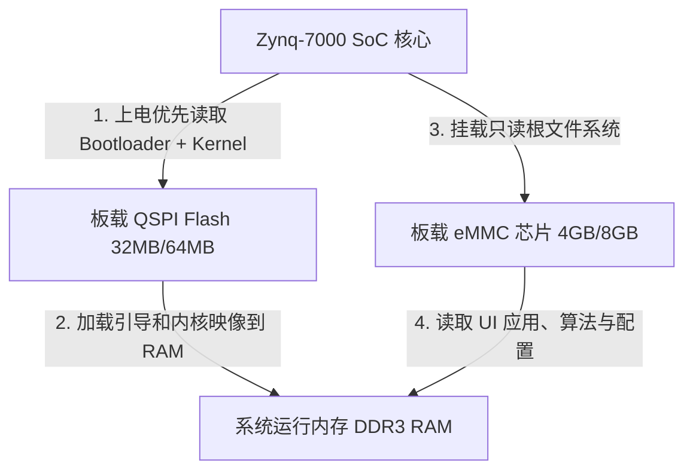

# Zynq 平台板载存储产品化与量产烧录方案

## 1. 方案背景与痛点分析

在开发调试阶段，使用外部插拔式的 SD 卡（或 TF 卡）加载系统虽然便于固件更新，但无法直接应用于工业级量产产品中。

### 1.1 外部 SD 卡的工业级致命缺陷
* **高振动环境下的接触不良**：数控切削机床（尤其是五轴联动加工）运行时振动幅度大，插拔式 SD 卡的弹片插槽极易因物理震动产生微小的接触瞬断。这会导致 Linux 系统发生严重的 I/O 读写错误，触发内核崩溃（Kernel Panic）。
* **写入寿命与断电损坏**：普通 SD 卡不具备高等级的磨损均衡（Wear Leveling）算法和坏块管理。在频繁的状态日志写入或现场非正常掉电时，极易造成文件系统结构损坏而导致黑屏无法开机。
* **白标化封锁**：外部 SD 卡可被轻易拔出，无法防止固件被读取、拷贝或反向分析，不符合工业白标化固化保护要求。

---

## 2. 硬件存储架构：焊接式存储设计（QSPI + eMMC）

产品化后，板卡上应采用直接焊接在 PCB 上的 **QSPI Flash + eMMC** 固态存储方案，完全消除物理接触断连隐患。

### 2.1 QSPI Flash 职责划分（板载焊接）
* **容量规划**：32MB 或 64MB。
* **存放内容**：`BOOT.BIN`（包含 FSBL 引导加载程序、FPGA 比特流、U-Boot 引导程序）以及 Linux 压缩内核映像（`image.ub`）。
* **特点**：通过 QSPI 总线直连，读取速度快，不参与任何高频用户态写入，运行极高可靠。

### 2.2 eMMC 芯片职责划分（板载焊接）
* **容量规划**：4GB 或 8GB（量产级工业芯片，支持 FTL 控制器）。
* **存放内容**：Linux 根文件系统（Rootfs）、C UI 可执行程序、动作 Broker 脚本以及控制配置文件。
* **特点**：直接焊接，具有优秀的坏块管理算法和防断电固件保护，比 SD 卡寿命高出数倍。

### 2.3 启动模式引脚配置（Boot Mode Selection）
* **开发阶段**：通过拨码开关选择 `SD Boot`（从 SD 卡读取引导）。
* **产品化阶段**：通过 PCB 上的 MIO 启动引脚上下拉电阻（Mode Strapping），固定为 `QSPI Boot`（优先从板载 QSPI 引导，再由 U-Boot 指向挂载 eMMC 的 Rootfs）。

---

## 3. 软件配合：eMMC 零写入与固件双备份

为了进一步延长板载 eMMC 的使用寿命，必须在软件架构上实施保护与冗余设计：

### 3.1 只读根文件系统（Read-Only Rootfs）配合
* eMMC 上的所有分区在日常运行时一律挂载为 **只读（ro）**。
* 运行日志、临时套接字（UDS sockets）以及状态数据一律挂载到内存（`tmpfs`），做到 **运行期 eMMC 零擦写**，彻底免疫非法断电。

### 3.2 A/B 双分区备份（防固件锁死）
* 在 eMMC 的分区规划中划分 `Rootfs A` 和 `Rootfs B` 两个镜像区。
* 系统升级时先写入备用区，若升级后无法通过自检，系统在重启时由 U-Boot 自动切回正常区启动，提供工业级自愈保障。

---

## 4. 工厂量产与烧录落地流程

产品化取消 SD 卡后，工厂产线可通过以下三种自动化流程之一进行批量烧录部署：

### 方案一：SMT 贴片前预烧录（推荐，高效率）
1. **流程**：在 SMT 贴片焊接前，通过高速 IC 烧录器（烧录座）直接将系统映像（Rootfs）批量写入 eMMC 芯片。
2. **优势**：贴片后板卡直接自带系统，上电即用，省去了产线烧写等待时间，量产效率极高。

### 方案二：网络 TFTP 自动化烧录（产线常用）
1. **准备工作**：板卡贴片完成后，通过 JTAG 接口（或串口进入极简 U-Boot）启动网络。
2. **下载与写入**：板子自动通过网口从产线 TFTP 服务器下载引导镜像和系统镜像，U-Boot 脚本执行 `sf write`（写入 QSPI）和 `mmc write`（写入 eMMC）。
3. **优势**：适合小批量或维护期更新，不需要提前拆包烧录芯片。

### 方案三：JTAG 自动注入烧录（适合首板与调测）
1. **流程**：使用 Vivado / Vitis 软件通过 JTAG 调试排线，直接运行 `program_flash` 命令向 QSPI Flash 写入 `BOOT.BIN`。
2. **优势**：无需依赖网络环境，适合样机阶段和首板激活。
