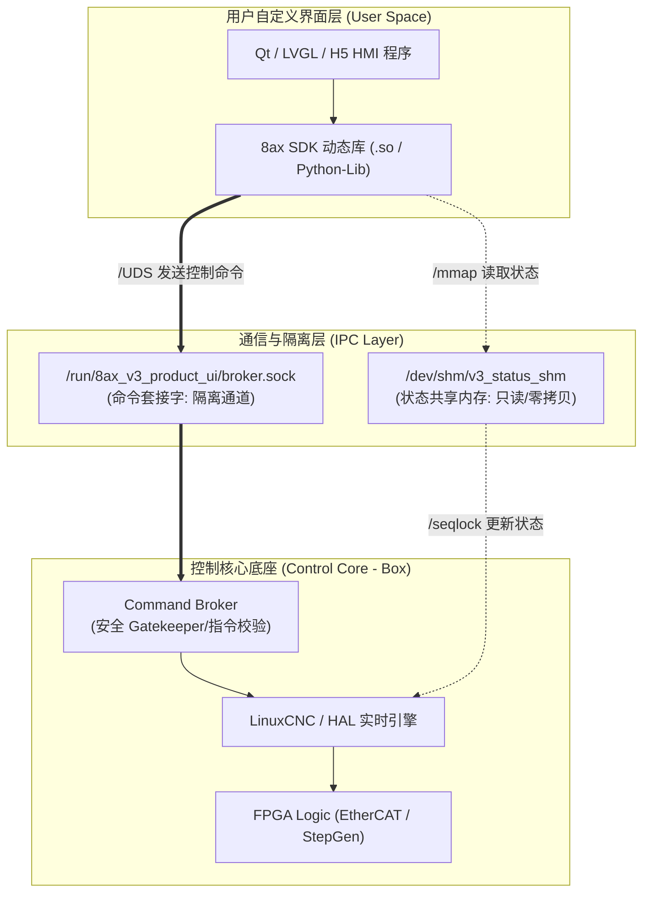

# （暂缓）v3 嵌入式控制黑盒 SDK 初步设想方案

当前状态：本文只作为未来 SDK/黑盒控制底座设想保留，默认 **暂缓推进**。`D:\re\v3\vivado_hw_project` 是当前 Vivado 工程；`D:\re\v3\pl-dma-vivado` PL/DMA Vivado 实验工程处于暂缓状态。不得因本文提到 FPGA 逻辑、传输层或 SDK 封装，就恢复运行 `pl-dma-vivado`、生成其 bit/XSA、接入产品启动链或替换当前 LinuxCNC/HAL/EtherCAT 控制路径。

本方案描述了如何将 Zynq-7000 开发板上的“FPGA逻辑 + 实时 LinuxCNC 内核 + EtherCAT/脉冲驱动”打包封装为一个高可靠性、高实时性的“运动控制黑盒”，并为二次开发用户提供友好、解耦的 SDK 接口，以支持用户自主编辑和重构人机交互界面（HMI）。

---

## 一、 系统解耦分层架构

为了保证控制底座的绝对安全和界面的高度灵活性，SDK 采用“物理隔离、内存共享、控制代理”的解耦架构设计：



1. **HMI 界面层**：用户可以使用任何开发工具（Qt, LVGL, C++, Python, HTML5 等）编写人机界面，仅需链接 SDK 库文件。
2. **通信隔离层**：
   * **状态通道**：基于 POSIX 共享内存，UI 通过 `mmap` 以零 CPU 开销直接读取实时坐标和状态。
   * **命令通道**：基于 Unix 域套接字（`UDS SOCK_STREAM`），UI 与底层之间通过可靠的流式连接交互。
3. **控制核心底座**：由提供商锁死的“运动控制黑盒”，包含硬核的 LinuxCNC 后端、运动学变换（RTCP）和物理 IO 逻辑。

---

## 二、 SDK 数据与控制接口设计 (API 规范)

SDK 将对外提供 C 接口动态链接库（`lib8ax_control.so`）及对应的 Python/WebSocket 语言绑定。

### 1. 状态监测接口 (共享内存结构体定义)

共享内存采用基于 `seqlock`（顺序锁）的安全数据结构，确保 UI 线程读取时不发生数据撕裂（Torn Read）。

```c
typedef struct {
    uint64_t sequence_id;        // 顺序锁标志位 (偶数表示数据稳定，库判断前后seq是否一致)
    uint64_t status_epoch;       // 状态时间戳 epoch

    // 坐标与速度信息
    double wcs_position[9];      // 逻辑坐标系当前坐标 (XYZUVWABC)
    double mcs_position[9];      // 机械坐标系当前坐标 (XYZUVWABC)
    double current_velocity;     // 当前线速度
    double feed_override;        // 进给倍率 (0.0 - 2.0)

    // 系统状态标志
    uint32_t interp_state;       // 插补状态 (1: Idle, 2: Run, 3: Pause)
    uint32_t estop_state;        // 急停状态 (0: 正常, 1: 急停中)
    uint32_t homed_mask;         // 回零掩码 (按位表示各轴是否已回零)
    uint32_t limit_mask;         // 硬限位报警掩码

    // G-code 运行信息
    uint32_t current_line;       // 当前运行的 G-code 行号
    char active_program[256];    // 当前载入的 G-code 文件名
} __attribute__((packed)) cbox_status_t;
```

### 2. 控制指令接口 (UDS 面向连接命令下发)

界面一切控制指令必须通过 SDK 的 API 下发，返回明确的应答包：

```c
// 初始化与通信连接
int cbox_sdk_init(const char* socket_path);
void cbox_sdk_close();

// 系统级控制
int cbox_set_estop(int state);           // 设置/清除急停 (state: 1=EStop, 0=Release)
int cbox_set_enable(int state);          // 控制器使能/下电

// 运动控制
int cbox_motion_jog(int axis, int dir, double speed);  // 手动点动
int cbox_motion_home(int axis);                        // 单轴回零
int cbox_motion_stop();                                // 运动紧急停止

// 加工程序控制
int cbox_program_open(const char* file_path);          // 载入 G 代码文件
int cbox_program_run();                                // 开始自动加工
int cbox_program_pause();                              // 暂停加工
int cbox_program_resume();                             // 恢复加工
```

---

## 三、 安全边界与物理锁死机制 (Fail-Closed)

开放 SDK 后，用户的界面程序容易出现崩溃、阻塞等故障。为了防止设备损坏，控制底座必须实施“零信任”安全防护：

### 1. 软件双向看门狗 (Software Watchdog)
* **工作机制**：当 UI 连接到 SDK 时，SDK 会在后台线程以 `50ms` 周期向底层的 Command Broker 发送握手心跳包。
* **超时锁死**：一旦用户的 UI 崩溃、挂起或意外退出，Broker 在连续 `150ms` 未收到心跳后，将自动判定 UI 失联，瞬间强制触发 LinuxCNC 急停，并在物理层切断电机使能，拉下安全抱闸。

### 2. 指令前置逻辑门禁 (Command Safety Gate)
底座的 `Command Broker` 在收到 SDK 的指令后，会通过状态机进行硬性安全性拦截，不依赖 UI 的正确性：
* **未回零拦截**：若轴未完成 `Home`，执行自动加工指令（`Run`）或大角度定位指令，Broker 直接拒绝执行，并返回错误码 `ERR_AXIS_NOT_HOMED`。
* **状态冲突拦截**：在联动加工（`Run`）状态下，若 SDK 发送 `Jog` 手动点动指令，底层直接拒绝，并返回 `ERR_CONFLICT_STATE`。

---

## 四、 跨平台与网络化扩展 (WebSocket / JSON Gateway)

为了支持非原生 C/C++ 平台（如 Android/iOS App、iPad 远控板或网页 HMI），SDK 方案支持在开发板的非实时核中启动一个轻量级的网关代理服务（8ax Web Gateway）：

1. **协议转换**：网关在板端运行，向下连接本地 UDS 和 SHM，向上转换为标准网络协议：
   * **只读状态数据**：以 `50ms` 周期通过 WebSocket 向客户端广播 JSON 状态帧。
   * **控制下发**：通过 HTTP POST (RESTful API) 接收远程控制指令。
2. **沙箱与鉴权**：远程网络连接可附加密钥校验与 IP 限制，确保非授权终端无法通过网络操作物理机床。
